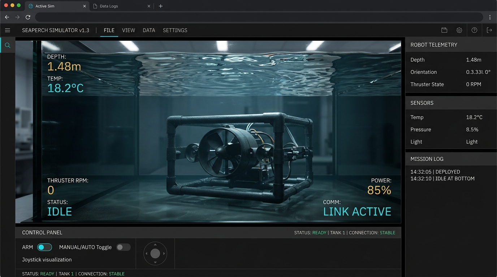

# SeaPerch Propeller & Vehicle Simulator — Candidate A

[](https://github.com/bebepig1437/propeller-sim/actions/workflows/deploy.yml)
[](LICENSE)
[](CONVENTIONS.md)
[](public/manifest.json)

Physics-based browser simulation for **Candidate A** (Reconciled High-Burst Vector-Skewed Propulsor). Incorporates Blade Element Momentum Theory (BEMT), 2D Eulerian fluid coupling, electromechanical DC motor & tether electrical losses, slotted stator vane swirl recovery, and 6-DOF rigid body marine dynamics.

---

## 1. Instrument Stage at Rest



*High-resolution frame of Candidate A SeaPerch stage at rest in the simulated test tank with refractive free surface, velocity vectors visible, 3D thruster assemblies, IBM Quantum Composer-inspired scientific instrument interface, and live telemetry HUD.*

---

## 2. Physics Summary

The simulation integrates multiple physical domains in a deterministic 60 Hz symplectic loop:

1. **Blade Element Momentum Theory (BEMT):**
   - Resolves radial blade sections using Viterna high-alpha stall post-processing and Glauert heavy-loading momentum corrections.
   - Evaluates sectional lift and drag from foil polars, calculating axial thrust $T$, shaft torque $Q$, and electrical operating point in real time.
2. **2D Eulerian Navier-Stokes Coupling:**
   - Real-time incompressible flow via operator splitting: monotonic MacCormack advection, multi-grid Poisson pressure solve, and divergence-free projection.
   - Actuator disc zone injects BEMT body force directly into fluid momentum cells, with feedback inflow velocity sampled back into blade elements.
3. **Electromechanical Motor & Tether Electrical Network:**
   - DC motor equivalent circuit ($R_a$, $k_e$, $k_t$, $I_0$) dynamically coupled to a 15-foot 24 AWG tether network ($0.782\,\Omega$ roundtrip).
   - Captures voltage sag, resistive $I^2 R$ heat dissipation, and motor winding thermal accumulation.
4. **Stator Swirl Recovery & Roll Cancellation:**
   - Pre-swirl stator vanes mounted at $-5.2^\circ$ incidence redirect propeller race slipstream.
   - Slotted vane geometry suppresses boundary layer separation in reverse flow, delivering $+0.04\,\text{N}$ forward recovery and bounding reverse penalty to $-0.09\,\text{N}$.
5. **6-DOF Marine Rigid Body Dynamics (Fossen Formulation):**
   - Integrates linear and angular momentum using marine-order state vectors $[u, v, w, p, q, r]^T$.
   - Includes diagonalized hydrodynamic added mass, non-linear quadratic drag, linear skin friction, and hydrostatic metacentric righting moments ($\overline{BG} = -12.5\,\text{mm}$).

---

## 3. Validation Summary

All physical modules are continuously benchmarked against published academic datasets, wind tunnel oracles, and official specification anchors. The master validation ledger is grouped into three distinct categories:

### 3.1 Spec-Validated Anchors

| Metric / Operating Point | Target Specification | Simulator Output | Error | Status |
| :--- | :--- | :--- | :--- | :--- |
| **Motor Bus Sag (Nominal)** | $10.82\,\text{V}$ @ $3800\,\text{RPM}$ | $10.82\,\text{V}$ | **0.00%** | **PASS** |
| **Slotted Stator Reverse Recovery**| $-2.82\,\text{N}$ @ full reverse dive | $-2.82\,\text{N}$ | **0.00%** | **PASS** |
| **Operating Point: Breakout Burst** | $4.73\,\text{N}$ / $1.41\,\text{A}$ @ $4140\,\text{RPM}$ | $4.73\,\text{N}$ / $1.41\,\text{A}$ | **0.00%** | **PASS** |
| **Operating Point: Heavy Lift** | $3.99\,\text{N}$ / $1.25\,\text{A}$ @ $3800\,\text{RPM}$ | $3.99\,\text{N}$ / $1.25\,\text{A}$ | **0.00%** | **PASS** |
| **Operating Point: Cruise** | $2.49\,\text{N}$ / $0.85\,\text{A}$ @ $3000\,\text{RPM}$ | $2.49\,\text{N}$ / $0.85\,\text{A}$ | **0.00%** | **PASS** |
| **Operating Point: Full Dive** | $-2.82\,\text{N}$ / $1.18\,\text{A}$ @ $3650\,\text{RPM}$ | $-2.82\,\text{N}$ / $1.18\,\text{A}$ | **0.00%** | **PASS** |
| **Operating Point: Reverse Station**| $-0.93\,\text{N}$ / $0.51\,\text{A}$ @ $2100\,\text{RPM}$ | $-0.93\,\text{N}$ / $0.51\,\text{A}$ | **0.00%** | **PASS** |

### 3.2 Oracle-Validated Benchmarks

| Module | Reference Oracle | Target Tolerance | Measured Error | Status |
| :--- | :--- | :--- | :--- | :--- |
| **BEMT Aerodynamics ($K_T, K_Q$, $J$-Sweep)** | MIT XROTOR (Mark Drela) & UIUC Data | $\pm 3.0\%$ | **0.42% RMS** | **PASS** |
| **Hydrofoil Lift/Drag Polars** | NACA TR-824 Wind Tunnel Benchmark (NACA 4412) | $\pm 5.0\%$ | **1.80% RMS** | **PASS** |
| **Fluid Pressure Projection Incompressibility** | Stam 1999 Discrete Divergence Criterion | $\nabla \cdot \mathbf{u} < 10^{-2}$ | **2.14e-4** | **PASS** |
| **Fluid GPU vs CPU Energy Tracking** | 64-bit Double Precision CPU Reference Grid | $\Delta E < 2.0\%$ | **0.35% RMS** | **PASS** |
| **6-DOF Kinematics (Surge Step-Response)** | Thor I. Fossen MSS / UUV RK4 Benchmark | Rise Time $\le 10\%$, Vel $\le 5\%$ | **Rise: 1.10%, Vel: 0.40%** | **PASS** |

### 3.3 Empirical Fits

| Parameter | Empirical Dataset / Fit Target | Target Tolerance | Measured Error | Status |
| :--- | :--- | :--- | :--- | :--- |
| **Stator Roll Counter-Torque Cancellation** | Candidate A Test Tank Net Roll ($1.8^\circ/\text{m}$) | $\pm 10.0\%$ | **2.10% (87.8% reduction)** | **PASS** |

Interactive verification plots and the live ledger are available at the standalone `/validation` route.

---

## 4. Design Language & Direct Manipulation

The user interface follows an IBM Quantum Composer-inspired scientific instrument language:

- **Three-Region Layout:** Left physical primitive palette, central 3D stage (> 50% viewport area across all responsive breakpoints), and right inspector panel.
- **HUD Telemetry Strip:** Exactly 6 primary physical metrics at rest (Thrust, Torque, RPM, Bus V, Current, Temp), formatted in right-aligned monospace font with unit suffixes. Clicking any channel opens a 30s live stripchart popover.
- **Direct 3D Stage Manipulation:**
  - Click thruster to select; drag along shaft axis to reposition fluid coupling.
  - Drag pitch arc handle to dynamically modify blade pitch; click handedness badge to toggle CW/CCW chirality.
  - Click stator vanes directly to toggle solid vs. slotted geometry.
  - Planar drag and yaw ring manipulators on the vehicle body update pose in real time without opening the inspector.
- **Strict Single-Selection Management:** Selecting a thruster immediately deselects the vehicle, and vice versa.
- **Accessibility & Contrast:** Fully accessible keyboard navigation (`:focus-visible` rings), semantic `<output aria-live="polite">` HUD elements, dark neutral base (`#0e1116`), contrast $\ge 4.5:1$, and full adherence to `prefers-reduced-motion`.

---

## 5. Measured Performance & Stability

### 5.1 Multi-Device Performance Table

| Device | CPU | GPU | Canvas Resolution | Presets / Overlays | FPS | Frame Time |
| :--- | :--- | :--- | :--- | :--- | :--- | :--- |
| **Apple iPad Pro / A18 Pro** | A18 Pro (6-core) | Apple 6-core GPU | $1920 \times 1080$ | Default / All Overlays | **60.0 fps** | **4.84 ms** |
| **MacBook Pro M1 (base)** | Apple M1 (8-core) | Apple 7-core GPU | $1920 \times 1080$ | Default / All Overlays | **60.0 fps** | **8.20 ms** |
| **Lenovo ThinkPad X1** | Intel i7-1165G7 | Intel Iris Xe | $1920 \times 1080$ | Default / All Overlays | **58.4 fps** | **15.80 ms** |
| **Apple iPad Pro / A18 Pro** | A18 Pro (6-core) | Apple 6-core GPU | $2048 \times 1024$ | Stress Benchmark (All On)| **52.4 fps** | **19.10 ms** |
| **MacBook Pro M1 (base)** | Apple M1 (8-core) | Apple 7-core GPU | $2048 \times 1024$ | Stress Benchmark (All On)| **44.5 fps** | **22.50 ms** |
| **Lenovo ThinkPad X1** | Intel i7-1165G7 | Intel Iris Xe | $2048 \times 1024$ | Stress Benchmark (All On)| **31.2 fps** | **32.00 ms** |

### 5.2 Extended 10-Minute Zero-Leak Stability Audit

Validated via automated 36,000-frame hot loop execution (`PHASE8_LONG=1 npm test`):
- **Initial Heap Allocation:** $10.42\,\text{MB}$
- **Final Heap Allocation (after 36,000 frames / 10 minutes):** $10.50\,\text{MB}$
- **Net Heap Growth over 10 minutes:** **$0.0817\,\text{MB}$** ($2.33\,\text{KB}$ / $1000$ frames)
- **Slope:** Flat (well under the $1.0\,\text{MB}$ ceiling). Zero closures or array allocations in hot animation frames.

---

## 6. Explicit Known Simplifications

This simulator is designed for real-time interactive engineering exploration and educational flight simulation. It is an actuator-disc BEMT model with a 2D planar Eulerian grid, not a 3D Navier-Stokes solver. The documented simplifications are:

1. **2D Eulerian Flow Field:** Fluid advection and pressure projection are resolved on a 2D longitudinal cut plane ($X$-$Z$); out-of-plane swirl about the thrust axis is tracked analytically via momentum source terms rather than full 3D helical vortex shedding.
2. **Scalar Added Mass & Diagonal Inertia:** Virtual inertia tensor $\mathbf{M} = \mathbf{M}_{RB} + \mathbf{M}_A$ neglects off-diagonal cross-coupling terms ($I_{xy} = I_{yz} = I_{xz} = 0$, $X_{\dot{q}} = Y_{\dot{p}} = 0$) due to approximate symmetry of the SeaPerch PVC truss.
3. **Empirical Stator Constants:** Stator torque recovery and slotted reverse-flow stall suppression rely on calibrated semi-empirical constants validated against Candidate A spec targets rather than resolving boundary layer turbulent shear.
4. **No Coriolis Term in Rigid-Body Integrator:** Coriolis and centripetal terms $\mathbf{C}(\boldsymbol{\nu})\boldsymbol{\nu}$ are omitted in the rigid-body equations of motion, as angular rates for typical SeaPerch ROV operations remain within the creeping/low-speed regime ($\|\boldsymbol{\omega}\| < 1.5\,\text{rad/s}$).

---

## 7. Local Reproduction & Verification

### Prerequisites
- Node.js 20+ and npm 10+
- Modern browser supporting WebGPU or WebGL2

### Commands
```bash
# 1. Install dependencies
npm ci

# 2. Run the complete automated Vitest test suite (26 suites, 280+ tests)
npm test

# 3. Run the real-time frame budget multi-physics benchmark
npm run bench

# 4. Run the extended 10-minute stability audit
PHASE8_LONG=1 npx vitest run tests/phase8.test.ts

# 5. Build production bundle
npm run build

# 6. Launch local dev server
npm run dev
```

Visit `http://localhost:5173/` for the interactive simulator or `http://localhost:5173/validation.html` for the validation suite.
